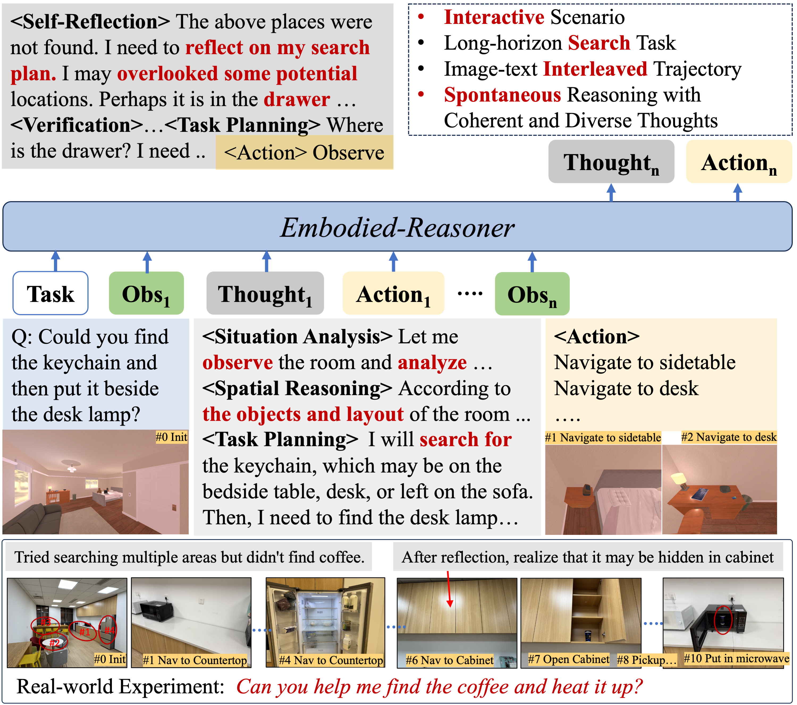
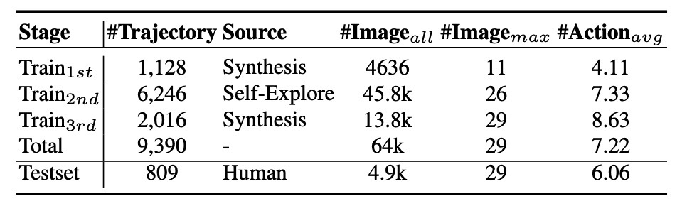
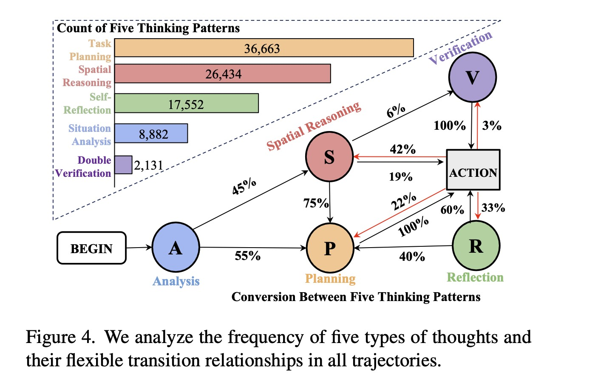
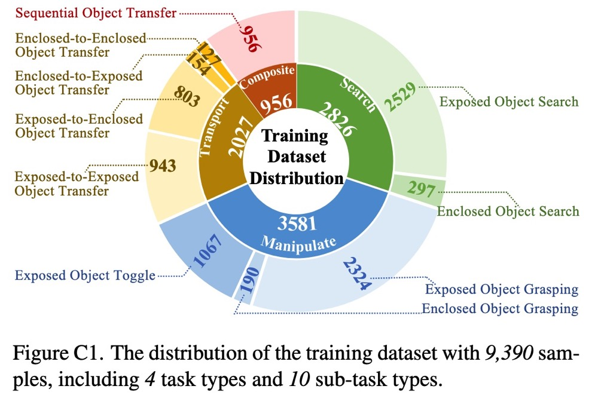
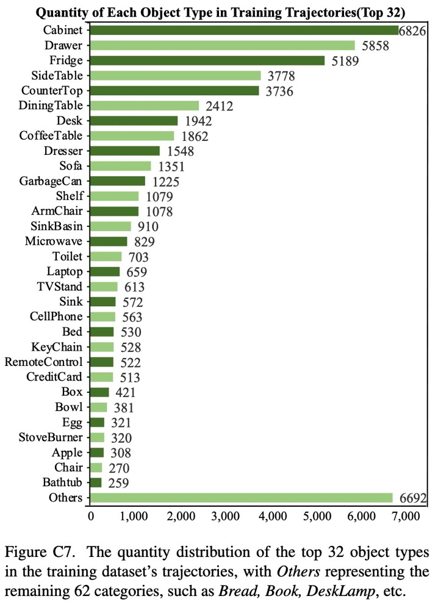
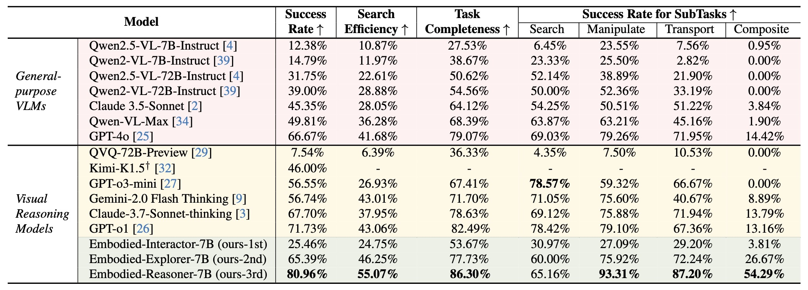
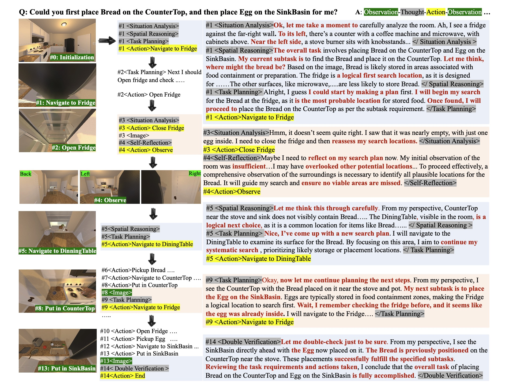
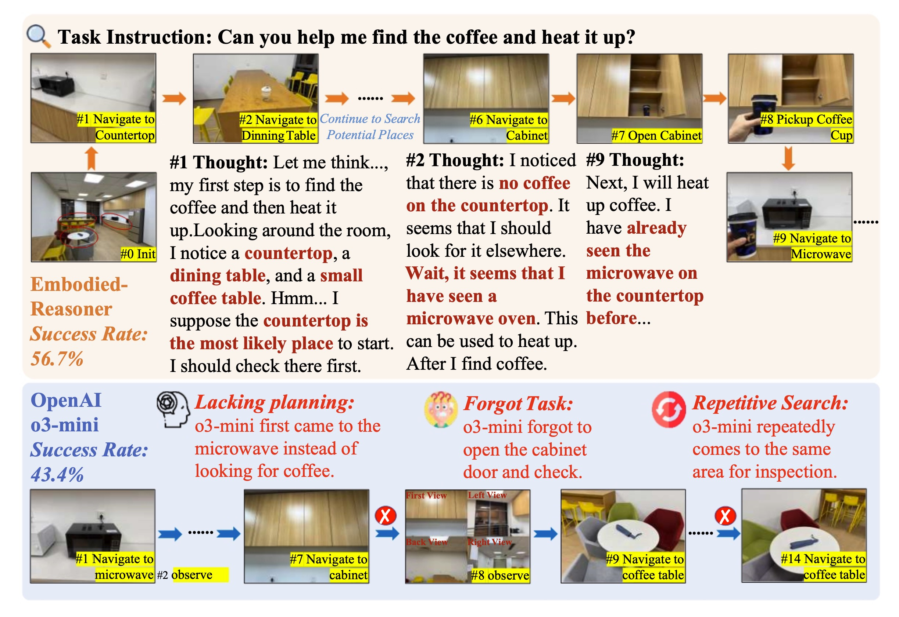

# Embodied-Reasoner 
✨This is the official implementation of paper 
<a href="https://arxiv.org/abs/2503.xxxxx">Embodied-Reasoner: Synergizing Visual Search, Reasoning, and Action for Embodied Interactive Tasks</a>

<p align="center">
    
<p>

<p align="center">
          🤗 <a href="https://huggingface.co/datasets/zwq2018/embodied_reasoner">Hugging Face</a>
          &nbsp&nbsp | &nbsp&nbsp 🤖 <a href="https://modelscope.cn/organization/qwen">ModelScope</a>
          &nbsp&nbsp | &nbsp&nbsp 📑 <a href="https://arxiv.org/abs/2503.xxxxx">Arxiv</a> 
          &nbsp&nbsp | &nbsp&nbsp 📑 <a href="https://embodied-reasoner.github.io">WebPage</a> 
<br>
</p>

## News 🔥🔥

- **2025.03:** We release our paper and dataset.

## Contents 🌳🌳
- [Overview](#Overview)
- [Performance](#preformance)
- [Examples](#examples)
- [Training](#training)
    - [Step 1. Install Requirements](#step-1-install-requirements)
    - [Step 2. Data prepare](#step-2-data-prepare)
    - [Step 3. Run Training Scripts](#step-3-run-training-scripts)
- [Evaluation](#evaluation)
    - [Step 1. Install Requirements](#step-1-install-requirements-1)
    - [Step 2. Run Evaluation Scripts](#step-2-run-evaluation-scripts)
- [Task and Trajectory Engine](#Overview)
- [Citation](#citation)
- [License](#license)

## Overview 👉👉
In this paper, we present **Embodied-Reasoner**, a multimodal embodied model that extends o1-style deep-reasoning capabilities to embodied interactive tasks. It can perform complex tasks in AI2THOR such as searching for hidden objects, manipulating and transporting items with several impressive features:
<div style="display: flex; align-items: center;">
  <div style="flex: 1;">
    <ul>
      <li><strong>Deep Reasoning</strong> abilities, e.g., <strong>analysis</strong>, <strong>spatial reasoning</strong>, <strong>reflection</strong>, <strong>planning</strong>.</li>
      <li><strong>Interleaved Multimodal Processing</strong> capabilities, especially handling long sequences of interleaved image-text context</li>
      <li><strong>Environmental Interaction</strong> abilities, enabling it to autonomously observe the environment, explore rooms, and find hidden objects</li>
      <li><strong>Open-source Models</strong> released in 7B/2B sizes</li>
      <li><strong>Open-source Dataset</strong> 🤗 <a href="https://huggingface.co/datasets/zwq2018/embodied_reasoner">Hugging Face</a>: 9.3k interleaved observation-reasoning-action trajectories, including 64K images and 8M thought tokens.</li>
    </ul>
  </div>
  <div style="flex: 1;">
    
  </div>
</div>


Our contributions can be summarized as follows:

> **Task and Trajectory Engine:** Automatically synthesizes coherent **Observation-Thought-Action** trajectories, spaning 107 diverse indoor scenes, e.g., kitchens and living rooms, and covers 2,100 interactive objects (e.g., eggs, laptops) and 2,600 containers (e.g., refrigerators, drawers), *64K* a first-person perspective image from interaction and *8M* thought tokens. 
<p align="center">
    
<p>  

> **Long CoT with Diverse Thinking Pattern:** analysis, spatial reasoning, reflection, planning, and verification. These coherent, image-text interleaved trajectories boost its spatial, temporal reasoning capabilities.
<p align="center">
    
<p>  

> **Iterative Training Pipeline:** A three-stage iterative training pipeline that combines **imitation learning**, **self-exploration tunning**, and **self-correction tunning**.   


> **Interactive Evaluation Framework:** 809 test cases across 12 novel scenarios: `<Instruction, Key Action, Final state >`

<p align="center">
    
    
<p>


## Performance 🌿🌿
We compare the performance of Embodied-Reasoner against advanced VLMs and visual reasoning models. 
- Success Rate (%) measures whether a task is successfully completed. 
- Search Efficiency (%) evaluates task efficiency—more steps indicate lower efficiency. 
- Task Completeness (%) computes the proportion of predicted actions that belong to the set of key actions.
<p align="center">
    
<p>

## Examples 👀 👀
### Simulator Experiments
Embodied-Reasoner exhibits spontaneous thinking behaviors, e.g., analyzing environmental states (#1,3), reflecting on missed details (#4), reasoning based on the latest observations (#5), and recalling cues for efficient planning (#9). These thoughts remain coherent and logically consistent despite spanning multiple rounds. In contrast, general VLMs lacking thinking abilities struggle with long-horizon interactive tasks and produce unreasonable actions, e.g., forget tasks or repetitive searching.

<p align="center">
    
<p>

### Real-World Experiments
To evaluate the generalization of our reasoning model, we design a real-world experiment. Our model rules out the countertop and dining table after two explorations (steps 1,2), ultimately locating the coffee (#7) in the cabinet and placing it in the microwave for heating (#11). However, we observe that OpenAI o3-mini fails to formulate a reasonable plan, heading to the microwave first instead of searching for the coffee.

<p align="center">
    
<p>

## QuickStart 🎯🎯
### Training

#### Step 1. Install Requirements
```shell
conda create -n llama-factory python=3.11
conda activate llama-factory
git clone -b embodied-reasoner https://github.com/iGangao/LLaMA-Factory.git
cd LLaMA-Factory
pip install -e ".[torch,metrics]"
pip install wandb accelerate deepspeed importlib-metadata
```

#### Step 2. Data prepare
Please refer to `data/README.md` for checking the details about the format of dataset files.

#### Step 3. Run training scripts
Run the training scripts:
```shell
bash scripts/train.sh
```

### Evaluation

#### Step 1. Install Requirements

```shell
conda create -n embodied-reasoner python=3.9
conda activate embodied-reasoner
pip install -r requirements.txt
```

#### Step 2. Run evaluation scripts
Run the evaluation scripts:
```shell
bash scripts/eval.sh
```

## Task and Trajectory Engine ⛲⛲
## Citation

If you find our work helpful, feel free to give us a cite.

```
@article{embodied-reasoner,
    title   = {Embodied-Reasoner: Synergizing Visual Search, Reasoning, and Action for Embodied Interactive Tasks}, 
    author  = {Wenqi Zhang and Mengna Wang and Gangao Liu and Huixin Xu and Yiwei Jiang and Yongliang Shen and Guiyang Hou and Zhe Zheng and Hang Zhang and Xin Li and Weiming Lu and Peng Li and Yueting Zhuang},
    journal = {arXiv preprint arXiv:2503.xxxxx},
    year    = {2025}
}
```

## License
[](LICENSE)

The codebase is licensed under 木兰. 

## Contact Us
If you have any questions, please contact us by email: 
zhangwenqi@zju.edu.cn, lipeng@iscas.ac.cn

## Acknowledgements
Our training code uses [LLaMA-Factory](https://github.com/hiyouga/LLaMA-Factory) and uses the Simulator with [Ai2-THOR](https://github.com/allenai/ai2thor). Thanks for their wonderful works.