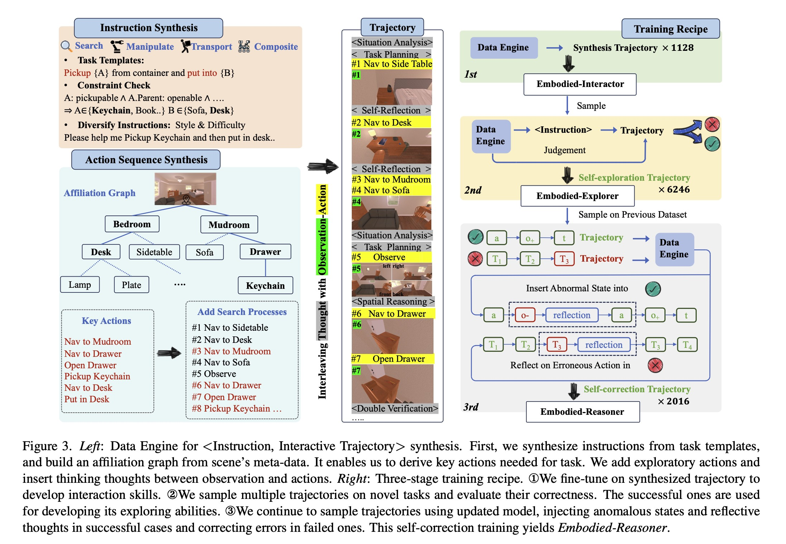

# Embodied-Reasoner
✨This is the official implementation of paper 
<a href="https://arxiv.org/abs/2503.xxxxx">Embodied-Reasoner: Synergizing Visual Search, Reasoning, and Action for Embodied Interactive Tasks</a>

<p align="center">
    
<p>

<p align="center">
          🤗 <a href="https://huggingface.co/Qwen">Hugging Face</a>
          &nbsp&nbsp | &nbsp&nbsp 🤖 <a href="https://modelscope.cn/organization/qwen">ModelScope</a>
          &nbsp&nbsp | &nbsp&nbsp 📑 <a href="https://arxiv.org/abs/2503.xxxxx">Arxiv</a> 
          &nbsp&nbsp | &nbsp&nbsp 📑 <a href="https://embodied-reasoner.github.io">WebPage</a> 
<br>
</p>

## News

- **2025.03:** Initial release.

## Contents
- [Introduction](#introduction)
- [Performance](#preformance)
- [Examples](#examples)
- [Training](#training)
    - [Step 1. Install Requirements](#step-1-install-requirements)
    - [Step 2. Data prepare](#step-2-data-prepare)
    - [Step 3. Run Training Scripts](#step-3-run-training-scripts)
- [Evaluation](#evaluation)
    - [Step 1. Install Requirements](#step-1-install-requirements-1)
    - [Step 2. Run Evaluation Scripts](#step-2-run-evaluation-scripts)
- [Citation](#citation)
- [License](#license)

## Introduction
In this paper, we present Embodied-Reasoner, a novel approach that extends deep-thinking capabilities to embodied interactive tasks. Our key insight is that effective embodied reasoning requires not just the ability to process multimodal inputs, but also to generate diverse thinking processes (analysis, planning, reflection) that adapt to different stages of an interaction.

<p align="center">
    
<p>

Our contributions can be summarized as follows:
- **Data Engine:** To develop this capability, we develop a data engine that automatically synthesizes coherent **Observation-Thought-Action** trajectories enriched with diverse, embodied-specific thinking processes. e.g., **situational analysis**, **spatial reasoning**, **self-reflection**, **task planning**, and **double verification**. These coherent, image-text interleaved trajectories guide the model to learn how to plan and reason based on its interaction history and spatial layout, thereby boosting its spatial and temporal reasoning capabilities.

- **Iterative Training Pipeline:** We further introduce a three-stage iterative training pipeline for embodied model that combines **imitation**, **self-exploration**, and **self-correction**.Begins with imitation learning on synthesized trajectories to develop basic interaction skills Followed by rejection sampling tuning to enhance exploration abilities Concludes with reflection tuning to foster self-correction.

- **Interactive Evaluation Framework:** We cultivate 809 test cases across 12 novel scenarios, which are different from training scenes. We manually design instructions and annotate corresponding key actions and final states: `<Instruction, Key Action, Final state >`. Notably, our test-set contains 25 carefully designed ultra long-horizon tasks, each involving four sub-tasks and 14 - 27 key actions.

## Performance
We compare the performance of Embodied-Reasoner against advanced VLMs and visual reasoning models. 
- Success Rate (%) measures whether a task is successfully completed. 
- Search Efficiency (%) evaluates task efficiency—more steps indicate lower efficiency. 
- Task Completeness (%) computes the proportion of predicted actions that belong to the set of key actions.
<p align="center">
    
<p>

## Examples
### Simulator Example
Embodied-Reasoner exhibits spontaneous thinking behaviors, e.g., analyzing environmental states (#1,3), reflecting on missed details (#4), reasoning based on the latest observations (#5), and recalling cues for efficient planning (#9). These thoughts remain coherent and logically consistent despite spanning multiple rounds. In contrast, general VLMs lacking thinking abilities struggle with long-horizon interactive tasks and produce unreasonable actions, e.g., forget tasks or repetitive searching.

<p align="center">
    
<p>

### Real-World Example
To evaluate the generalization of our reasoning model, we design a real-world experiment. Our model rules out the countertop and dining table after two explorations (steps 1,2), ultimately locating the coffee (#7) in the cabinet and placing it in the microwave for heating (#11). However, we observe that OpenAI o3-mini fails to formulate a reasonable plan, heading to the microwave first instead of searching for the coffee.

<p align="center">
    
<p>

## QuickStart
### Training

#### Step 1. Install Requirements
```shell
conda create -n llama-factory python=3.11
conda activate llama-factory
git clone -b embodied-reasoner https://github.com/iGangao/LLaMA-Factory.git
cd LLaMA-Factory
pip install -e ".[torch,metrics]"
pip install wandb accelerate deepspeed importlib-metadata
```

#### Step 2. Data prepare
Please refer to `data/README.md` for checking the details about the format of dataset files.

#### Step 3. Run training scripts
Run the training scripts:
```shell
bash scripts/train.sh
```

### Evaluation

#### Step 1. Install Requirements

```shell
conda create -n embodied-reasoner python=3.9
conda activate embodied-reasoner
pip install -r requirements.txt
```

#### Step 2. Run evaluation scripts
Run the evaluation scripts:
```shell
bash scripts/eval.sh
```


## Citation

If you find our work helpful, feel free to give us a cite.

```
@article{embodied-reasoner,
    title   = {Embodied-Reasoner: Synergizing Visual Search, Reasoning, and Action for Embodied Interactive Tasks}, 
    author  = {Wenqi Zhang and Mengna Wang and Gangao Liu and Huixin Xu and Yiwei Jiang and Yongliang Shen and Guiyang Hou and Zhe Zheng and Hang Zhang and Xin Li and Weiming Lu and Peng Li and Yueting Zhuang},
    journal = {arXiv preprint arXiv:2503.xxxxx},
    year    = {2025}
}
```

## License
[](LICENSE)

The codebase is licensed under 木兰. 

## Contact Us
If you have any questions, please contact us by email: 
zhangwenqi@zju.edu.cn, lipeng@iscas.ac.cn

## Acknowledgements
Our training code uses [LLaMA-Factory](https://github.com/hiyouga/LLaMA-Factory) and uses the Simulator with [Ai2-THOR](https://github.com/allenai/ai2thor). Thanks for their wonderful works.